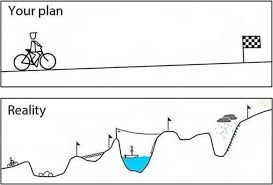

# How to Successfully Learn in this Bootcamp

## Agenda
- General advice and how to prepare yourself emotionally
- Some qualities of the most successful students
- Classroom culture
- Overview of "grit"
- Overview of common student concerns

## Emotional Framing

- Things will not go as you plan 

- Learning to code and level up your problem solving skills is really hard. Being confused/lost is NORMAL. Eventually, your job will be to find/innovate solutions to problems. Learning to do this requires leaning into the discomfort of not knowing the answer right away, doing research and being stuck.

- The maximum point of learning is right at the edge of learning and panic. 

- This experience is a rollercoaster. 

## Successful students

- The most successful students find programming fascinating. They don't think of it as an obligation or chore

- The most successful students go above and beyond what we teach. If there is something they feel they should know, they will go and learn it. If there is a
problem for which they think they need more information to solve, they go and find that information

- The most successful students don't wait for instructors to hand them the answer

-  Successful students quickly see that programming is not about learning a recipe, it's about developing a mindset to solve unforeseen problems

- Successful students work hard to understand thing rather than focusing on memorizing all the small details

- Hard Work: the equivalent of two full-time jobs (~80 hrs per week)

- We will never ask you to sacrifice self care. Make sure you are finding ways to take care of yourself - sleeping, eating right and taking time to destress, as needed.

- This is a 12 week commitment to take you from beginner to job-ready: the more you put into this course the more you'll get out of it

- Be open and ready to receive constructive criticism

## Classroom Culture

- Open safe environment
- Take ownership of your experience
- Check your ego at the door
- Empathy
- Be courteous calm and patient with others.  
- Don't compare yourself to others, compare yourself to who you were yesterday

### Mentorship / Collaborative Culture in the Classroom

- Take care of each other
- Benchmarking: some are good at one thing, others at another. Leverage each other's strengths.
- Teaching is the best way of truly solidifying your understanding of a concept. It also will help you learn to talk about code in a meaningful way that will help with interviews and being on a job
- Your classmates will be the best foundation for establishing a professional network in tech!

## Grit
Follow through for your dreams in the long run. Be strong through the rough patches. Grow from your struggles. It's more important to learn than to

- Jill's example is being used only because of the great photo.  Her story is **not** unique.
- This is like three months of "cramming for finals"
- Watch this [video on Grit]( https://www.ted.com/talks/angela_lee_duckworth_the_key_to_success_grit?language=en)

## Common Student Concerns

- I'm making a lot of mistakes
	- mistakes are a part of life as a developer

- I don't feel comfortable with the material
	- you probably will never feel the material is easy, but you should be able to do the work
	- by the end of each unit project, you should feel mostly comfortable with the material

- I feel good during class, but it's difficult to innovate on my own
	- There are three stages to learning something:
		- *Imitation* (follow along) - Lectures
		- *Assimilation* (repetitive simple tasks: homework and labs)
		- *Innovation* (build something new on your own - project time)

- Everyone at work will realize I know nothing
	- this is called the imposter syndrome, and it's very common
	- nobody knows everything, it's about how well you learn and how you approach solving problems

- I don't "do" math
	- that's why we have the computer do it for us!
	- programming is more about thinking logically than doing equations

- What's the best practice? What's the one "correct" answer?
	- Best practices change constantly and from company to company
	- If you think properly, you'll probably naturally arrive at a best practice
	- All that matters is "Does it work?"
		- As you grow as a developer you'll slowly learn more to code better. It's going to be messy at first! It's ok!
		- Use your time to learn new technology or strengthen your problem solving

- I don't have a perfect understanding of everything
	- Class is set up to accommodate students of all abilities
		- We create lecture notes, homework, and projects so that advanced students can have something to work on
		- Repetition, repetition repetition: give yourself patience that it may take a few passes to really start feeling comfortable with a concept
	- We make sure you understand at least the most important concepts
	- Only the people who write the specifications for the language understand everything about the language

- I want an amazing portfolio and to complete all my labs/assignments
	- most professional web sites take a minimum of 6 months and a whole team of people to make them. What you build in ~6 days will be great but it won't have all the features a professional app has and that's ok!
	- don't worry about completing every lab/homework, focus on making progress and learning
		- they're there as an exercise in thinking with enough material for all
		- completing and sleeping for 2 hours is worse than sleeping and not completing: you won't be ready to take on new materials if you haven't taken care of yourself

For more [tips and tricks,](3.%20TIPS_AND_TRICKS.md) feel free to reference this document that has been compiled by Matt Huntington (GA WDIR Instructor)
